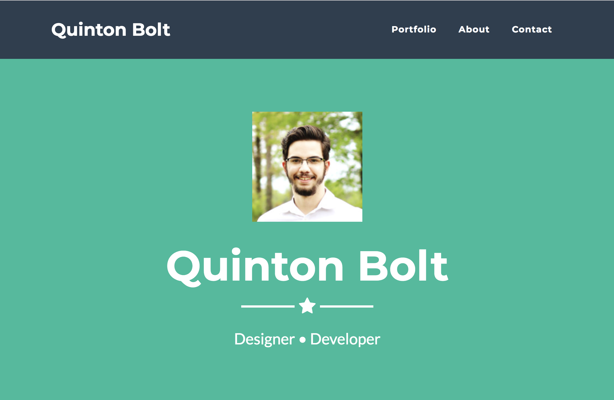
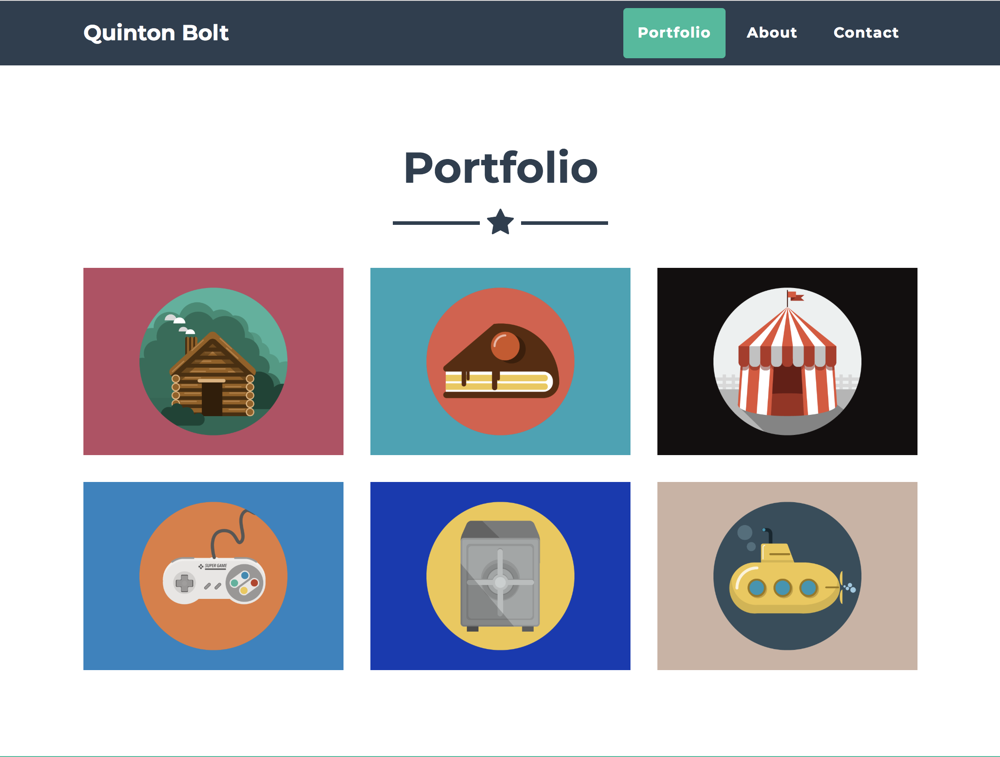
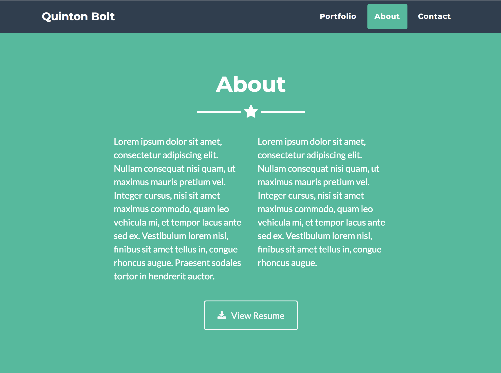
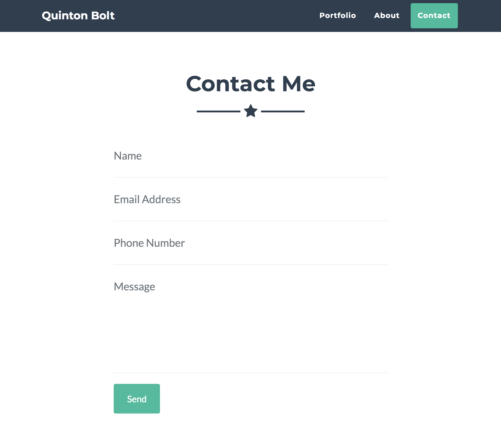

# Portfolio Assignment
# Overview

For this assessment, students are given images that simulate a mockup of a portfolio from a designer and are required to implement this mockup using HTML and CSS. Students will fill in the portfolio with their own picture, information, and projects.

The image files are also located in the repository on GitHub.

## Home - `index.html`

Replace existing name with your name and summary text with your own small summary.

## Portfolio - `portfolio.html`

The project images can just be random images for now - In the future, the would presumably link to the projects home page or GitHub repository.

## About - `about.html` 

Replace with an appropriate summary of your TYS - focus on the technical side of things.

Assume that the `View Resume` link will open your resume in a **new tab**.

## Contact - `contact.html`

All fields are required, and when submitted, will e-mail form to your e-mail address.

[HTML Email Form Example](https://www.w3schools.com/html/tryit.asp?filename=tryhtml_form_mail)

